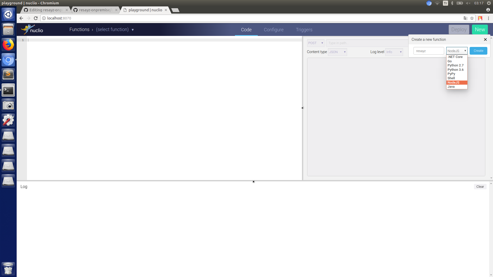
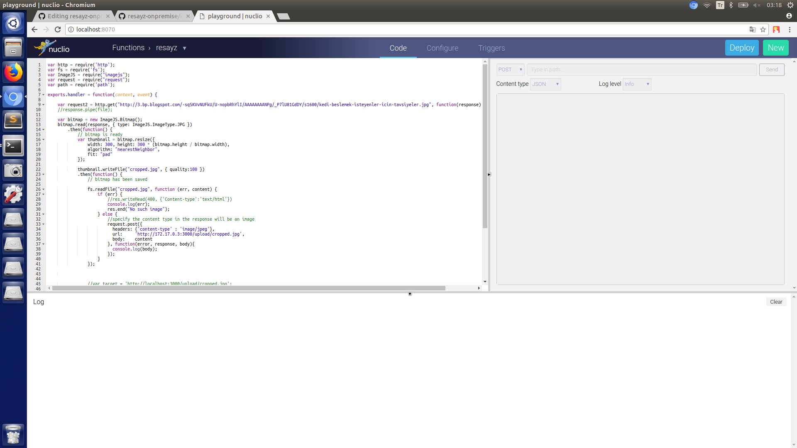
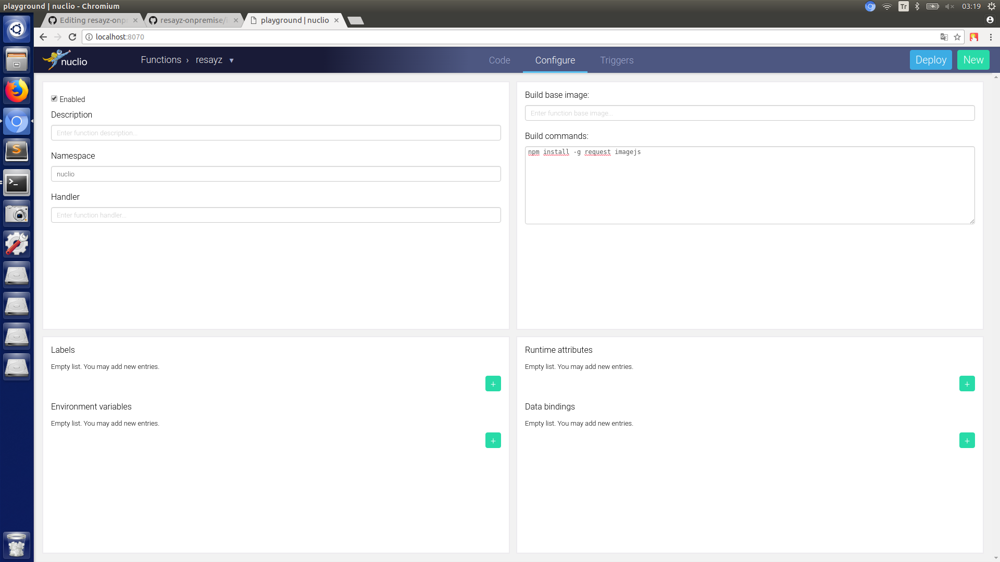
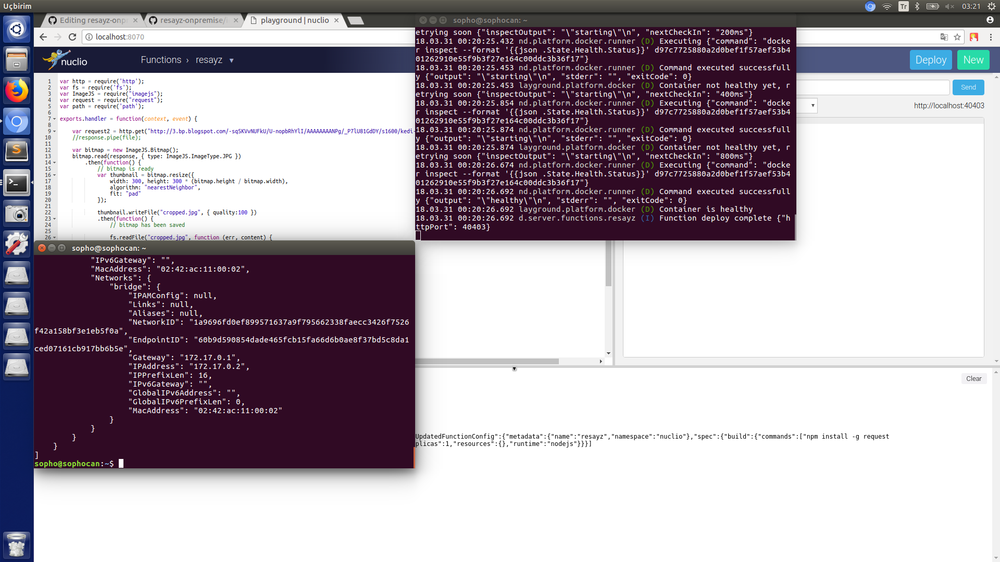
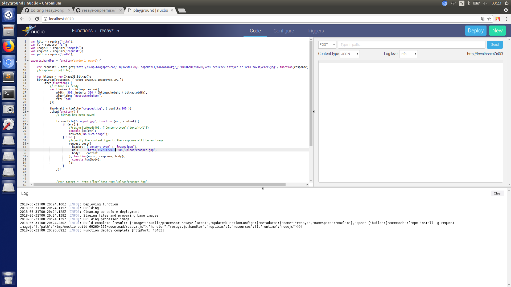
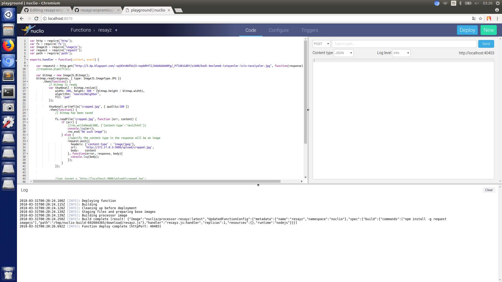
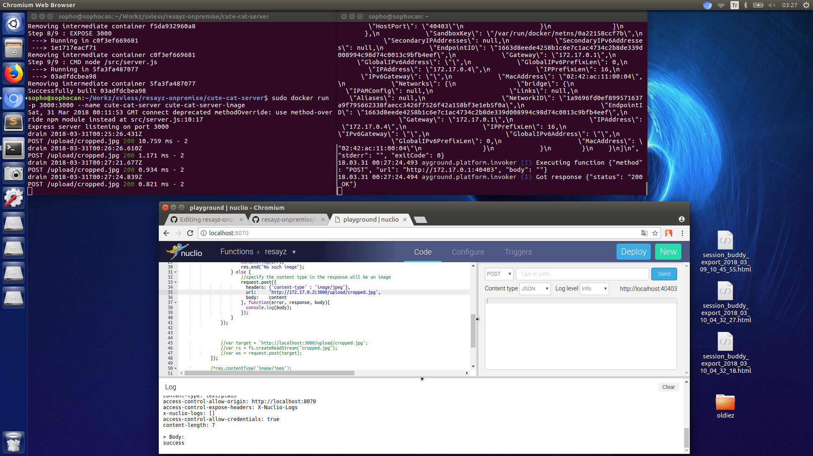
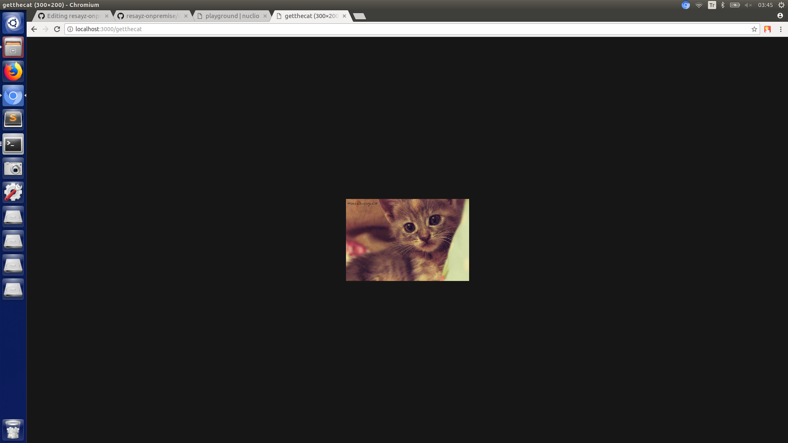

# resayz - Build your own on-premise serverless Whatsapp image resize with Nodejs & Nuclio

This is the on-premise code inspired from Whatsapp image resize, and beyond the light idea of implementing it on an on-premise solution. 

Code has 2 parts:

1-  Serverless function, to download a pre-selected Http cat image from Internet and resize

2-  A simple file server, to push file and see it in browser

Full code detail at https://github.com/oceylantr/resayz-onpremise

## Getting Started

### Prerequisites

1-  Linux distro (tried on Ubuntu 16.04 LTS)

2-  A ready, helloWorld running Docker installation. If you are about to setup Docker-CE, you can refer to http://oguzhanceylan.com/2018/03/03/docker-ce-installation-on-fresh-ubuntu-16-04/

3- Docker-compose. If you are about to install Docker-compose please refer to https://docs.docker.com/compose/install/

3- Chmod -R 777 (a general precaution for not struggling with permissions)

4- Git

### Installing File Server (Cute Cat Server)

Download code with below command on your working directory:

```
sudo git clone https://github.com/oceylantr/resayz-onpremise.git
```

Give all permission for passing security phase now:

```
sudo chmod -R 777 resayz-onpremise
```

Get in the code 

```
cd resayz-onpremise
```

Firstly, we have code at File Server part waiting for build

```
cd cute-cat-server
sudo docker build -t cute-cat-server-image .
```

Let's run our file server with recently created cute-cat-server image !!

```
sudo docker run -p 3000:3000 --name cute-cat-server cute-cat-server-image
```

### Installing Nuclio and Our Resayz Function

Please run following command to run Nuclio Playground:

```
sudo docker run -p 8070:8070 -v /var/run/docker.sock:/var/run/docker.sock -v /tmp:/tmp nuclio/playground:stable-amd64
```
After installation you will see Nuclio Playground server running. Now it is time to create our function on playground. Click New, name it "resayz", runtime is "Nodejs"



Now, starting to build function. Open index_nuclio.js and copy whole function js code and paste it to Nuclio function editor



Wait there, we have work. Navigate to Configure tab and in Build commands write dependecy package installation code:

```
npm install -g request imagejs
```



open a terminal, and write that command to get ip of File-Server container, due to some route problems. We will write this IP to Post parameters of serverless function, note the IP-Address part:

```
sudo docker inspect cute-cat-server
```



Now, change IP at function line 35, where post url is:



Everything is ready to launch; press Deploy and see Log section:



Now it is time to make a call to our serverless function. Resayz function will get an image from Internet, will resize to 300-200, then push to our file server named "Cute-Cat-Server" and we will see file coming to our File Server as an Upload sentence



You can check it in browser with old image at http://3.bp.blogspot.com/-sqSKVvNUFkU/U-nopbRhYlI/AAAAAAAANPg/_P7lU81GdDY/s1600/kedi-beslemek-isteyenler-icin-tavsiyeler.jpg

and new image at link localhost:3000/getthecat !!!




## Built With

* [Nodejs](https://nodejs.org) - Crazy maestro js backend architecture
* [ExpressJS](https://expressjs.com/) - Popular NodeJS framework for routing here
* [Docker](https://www.docker.com/) - You know what it is I think
* [Nuclio](https://nuclio.io/) - On Premise serverless product, best I think !!

## Authors

* **Oğuzhan Ceylan** - *Initial work* - [oceylantr](https://github.com/oceylantr)

## License

This project is licensed under the GPL v3.0 - see the [LICENSE](LICENSE) file for details

## Acknowledgments

* Containerizing File Server (Thanks to Joseph Jude when containerizing Hapi-Node backend https://jjude.com/hapijs-on-docker/)
